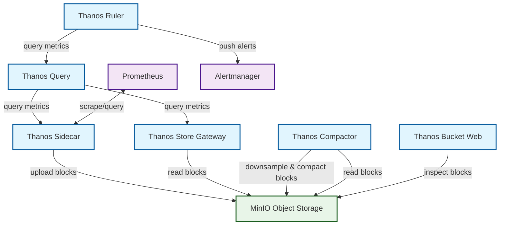

#technology
# Description
Thanos is a Database made for Prometheus but can be linked to many other system in order to keep data for a long time. Thanos can store data from many other databases, store them safely and be able to query in them. Data can be stored up to 1 year.

Thanos can easily be linked with Prometheus and Grafana and act as a middleware that will unsure that the metrics are stored for longer.

# Architecture 

# Thanos Stack

The **Thanos Stack** is a set of components that extends Prometheus for **high availability**, **long-term storage**, and **global querying** in cloud-native environments. Here's a breakdown of the key components you asked about:

---
## 🔹 1. **Thanos Sidecar**

- **Purpose**: Acts as a bridge between Prometheus and the Thanos ecosystem.
- **Responsibilities**:
    - Uploads Prometheus TSDB blocks to object storage (e.g., S3, GCS).
    - Exposes Prometheus metrics to Thanos Query.
    - Ensures Prometheus data is available even if the Prometheus instance goes down.
- **Runs alongside**: Each Prometheus instance.

---
## 🔹 2. **Thanos Receiver**

- **Purpose**: Accepts remote write requests from Prometheus or other systems.
- **Responsibilities**:
    - Acts like a remote write endpoint.
    - Stores incoming time series data in TSDB blocks.
    - Can be sharded and scaled horizontally.
- **Use case**: Centralized ingestion point for metrics in microservices or Kubernetes environments.

---
## 🔹 3. **Thanos Store**

- **Purpose**: Exposes historical data from object storage to the Thanos Query layer.
- **Responsibilities**:
    - Reads TSDB blocks from object storage (e.g., S3).
    - Serves them to Thanos Query for long-term queries.
- **Use case**: Enables querying of data that is no longer in Prometheus memory.

---
## 🔹 4. **Thanos Compactor**

- **Purpose**: Optimizes and manages TSDB blocks in object storage.
- **Responsibilities**:
    - Compacts smaller blocks into larger ones.
    - Downsamples data (e.g., from 5s to 1m resolution).
    - Applies retention policies.
- **Use case**: Reduces storage costs and improves query performance.

---
## 🔹 5. **Thanos Query**

- **Purpose**: The central query engine of Thanos.
- **Responsibilities**:
    - Aggregates data from multiple Prometheus instances, Sidecars, Stores, and Receivers.
    - Provides a single global view of all metrics.
    - Supports PromQL queries.
- **Use case**: Unified querying across clusters, regions, and time ranges.

---
## 🧭 How They Work Together

1. **Prometheus + Sidecar**: Prometheus scrapes metrics, Sidecar uploads them to object storage.
2. **Receiver**: Accepts remote writes and stores them in TSDB format.
3. **Compactor**: Periodically compacts and downsamples data in object storage.
4. **Store**: Reads historical data from object storage.
5. **Query**: Aggregates data from all sources and serves it to users or dashboards.

# Thanos Pattern

## **Sidecar Pattern**:
- Prometheus + Thanos Sidecar → Object Storage
- Thanos Query connects to Sidecar and Store Gateway
- No Receiver needed
Simple to deploy but need receiver if other ressources are needed.

## **Remote Write Pattern**:
- Prometheus → Thanos Receiver → Object Storage
- Thanos Query connects to Receiver and Store Gateway
- No Sidecar needed
Harder to deploy but same kind of resource for every source.